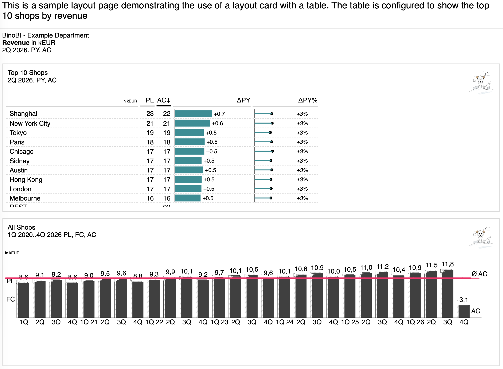

<p align="center">
  
</p>

<h1 align="center">bino</h1>

<p align="center">
  <strong>Pixel-perfect PDF reports from YAML manifests and SQL queries.</strong>
</p>

<p align="center">
  <a href="https://github.com/bino-bi/bino-cli/blob/main/LICENCE"></a>
  <a href="https://github.com/bino-bi/bino-cli-releases/releases/latest"></a>
  <a href="https://github.com/bino-bi/bino-cli/actions"></a>
  <a href="https://github.com/bino-bi/bino-cli"></a>
</p>

<p align="center">
  <a href="https://cli.bino.bi">Documentation</a> &middot;
  <a href="https://github.com/bino-bi/bino-cli-releases/releases/latest">Download</a> &middot;
  <a href="https://github.com/bino-bi/bino-cli/discussions">Discussions</a>
</p>

<br />

<p align="center">
  
</p>

<br />

> [!WARNING]
> bino is under active development. Configuration and CLI APIs are not yet stable — expect breaking changes between releases.

> [!NOTE]
> bino is currently tightly coupled to [bn-template-engine](https://github.com/bino-bi/bn-template-engine) as its visualization engine. This coupling will be removed in a future release, making the Viz Engine pluggable.

## What is bino?

bino is a command-line tool that turns declarative YAML manifests and SQL queries into production-ready PDF reports. It uses [DuckDB](https://duckdb.org/) as an embedded SQL engine and Chrome headless shell for pixel-perfect PDF rendering.

For full documentation, visit **[cli.bino.bi](https://cli.bino.bi)**.

## Highlights

- **Declarative reports** — Define data sources, queries, layouts, and artefacts in YAML. No imperative code required.
- **SQL-native** — Query CSV, Excel, Parquet, and databases using DuckDB's full SQL dialect.
- **Pixel-perfect PDFs** — Chrome headless shell renders HTML templates to PDF with precise control over layout, pagination, and styling.
- **Live preview** — `bino preview` watches for changes and hot-reloads in the browser via SSE.
- **Validation & linting** — `bino lint` catches manifest errors before build. JSON Schemas power IDE auto-completion.
- **VS Code extension** — YAML validation and auto-completion for bino manifests, available in `vscode-bino/`.

## Quick Start

### Install

**macOS (Homebrew):**

```bash
brew install bino-bi/tap/bino-cli
```

**Linux / macOS (script):**

```bash
curl -fsSL https://github.com/bino-bi/bino-cli-releases/releases/latest/download/install.sh | bash
```

**Windows (PowerShell):**

```powershell
irm https://github.com/bino-bi/bino-cli-releases/releases/latest/download/install.ps1 | iex
```

Or download a binary from the [latest release](https://github.com/bino-bi/bino-cli-releases/releases/latest).

### First Report

```bash
bino init my-report      # scaffold a new report bundle
cd my-report
bino build               # build all artefacts
```

See the [Getting Started guide](https://cli.bino.bi/getting-started/first-report/) for a full walkthrough.

## Architecture

```
Manifest Discovery → YAML Parsing → Validation → Datasource Collection → Dataset Execution → HTML Rendering → PDF Generation
```

Manifests are YAML documents typed by a `kind` field (DataSource, DataSet, LayoutPage, ReportArtefact, etc.). DuckDB serves as the embedded SQL engine for all data queries. Chrome headless shell converts rendered HTML into PDF output.

<details>
<summary>Directory structure</summary>

```
cmd/bino/main.go        Entry point with signal handling and context setup
internal/cli/            CLI commands (build, preview, serve, lint, graph, init, lsp, cache)
internal/report/         Core report processing engine
  config/                  YAML manifest loading and validation
  spec/                    Schema and constraint definitions
  datasource/              Data source collection (CSV, Excel, databases via DuckDB)
  dataset/                 SQL query execution
  pipeline/                Build orchestration
  render/                  HTML/PDF rendering
pkg/duckdb/              Exportable DuckDB session wrapper
vscode-bino/             VS Code extension (TypeScript)
docs/                    Documentation website (cli.bino.bi)
```

</details>

## Building from Source

### Prerequisites

- Go 1.25 or later
- CGO enabled (required for DuckDB)
- Chrome headless shell (for PDF rendering — `bino setup` downloads it automatically)

### Build

```bash
goreleaser build --snapshot --clean --single-target
```

On macOS, copy the binary to your PATH and sign it:

```bash
cp ./dist/bino_darwin_arm64_v8.0/bino ~/go/bin/bino
codesign --force --sign - ~/go/bin/bino
```

## Development

```bash
go test -v -race ./...          # run all tests
golangci-lint run ./...         # run linter
go test -run TestName ./...     # run specific test
go test -v -race -coverprofile=coverage.out ./...  # test with coverage
```

<details>
<summary>Runtime limit overrides</summary>

| Variable                    | Default | Description                        |
| --------------------------- | ------- | ---------------------------------- |
| `BNR_MAX_MANIFEST_FILES`    | 500     | Max manifest files to scan         |
| `BNR_MAX_QUERY_ROWS`        | 100,000 | Max rows returned per query        |
| `BNR_MAX_QUERY_DURATION_MS` | 60,000  | Query timeout in milliseconds      |
| `CI`                        | —       | Set to `1` to disable update check |

</details>

## VS Code Extension

The `vscode-bino/` directory contains a VS Code extension providing YAML validation and auto-completion for bino manifests. See [`vscode-bino/`](vscode-bino/) for build instructions.

## Contributing

Contributions are welcome! Please read the [Contributing Guide](CONTRIBUTING.md) before submitting a pull request.

## Security

To report a vulnerability, please see our [Security Policy](SECURITY.md).

## License

This project is licensed under the **GNU Affero General Public License v3.0 (AGPLv3)** — see the [LICENCE](LICENCE) file for details.

The VS Code extension in `vscode-bino/` is licensed separately under the **MIT License** (see [`vscode-bino/LICENSE`](vscode-bino/LICENSE)).

### Commercial licensing

bino/bino-cli is also available under separate commercial terms for customers who cannot comply with AGPLv3 (e.g., closed-source SaaS deployments or embedding bino in proprietary products). Contact **sven@bino.bi** for a commercial license quote.

All contributions are accepted under a [Contributor License Agreement](CLA.md) that permits this dual-licensing model.

## Third-Party Dependencies

Run `bino about` to list all direct dependencies with their licenses and upstream URLs.
