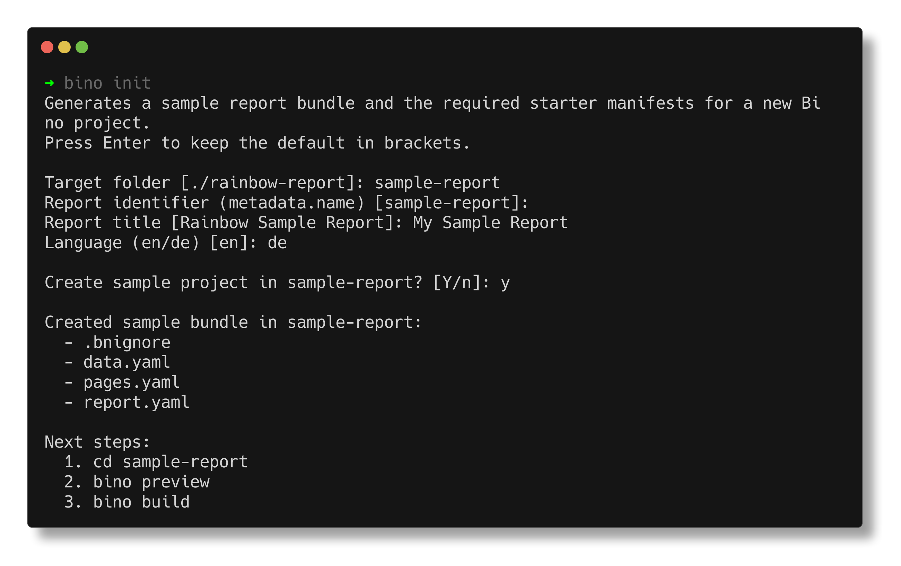

`bino init` creates a new workdir with sample manifests, data, and configuration.
It is the recommended way to start a new report bundle.

## Usage

```bash
bino init [flags]
```

Common flags:

- `--directory, -d` – target directory (default: current directory).
- `--name` – internal report name.
- `--title` – human-readable report title.
- `--language` – language code (for example `en`, `de`).
- `-y, --yes` – run non-interactively with defaults.
- `--force` – overwrite existing files.



## Examples

Create a bundle in the current directory interactively:

```bash
bino init
```

Create a bundle in a new directory with explicit title and language:

```bash
bino init --directory monthly-report --title "Monthly Sales" --language en
```

Run non-interactively with defaults, overwriting existing files:

```bash
bino init -d my-report -y --force
```

After initialization, continue with [Your first report](/getting-started/first-report/).

## The bino.toml Configuration File

Every Bino project contains a `bino.toml` file in its root directory. This file stores the project's unique identifier and can define default arguments and environment variables for CLI commands.

### Structure

```toml
report-id = "550e8400-e29b-41d4-a716-446655440000"

[build.args]
out-dir = "dist"
browser = "chromium"
log-sql = false
no-lint = false

[build.env]
BNR_MAX_QUERY_ROWS = "50000"
DATABASE_URL = "postgres://localhost/mydb"

[preview.args]
port = 8080
lint = true

[preview.env]
BNR_MAX_QUERY_ROWS = "10000"
```

### Setting Command Defaults

You can define default values for any flag supported by `bino build` or `bino preview`. When you run a command, the CLI:

1. Reads the defaults from `bino.toml`
2. Applies any explicit command-line flags (which override the TOML values)
3. Logs an info message when a TOML value is overridden

#### Build Defaults

Configure defaults for `bino build` in the `[build.args]` section:

```toml
[build.args]
out-dir = "output"           # Output directory for generated PDFs
browser = "firefox"          # Browser engine: chromium, firefox, webkit
log-sql = true               # Log SQL queries during build
no-graph = true              # Skip dependency graph files
no-lint = false              # Run lint rules (default)
log-format = "json"          # Build log format: text or json
embed-data-csv = true        # Embed CSV data in logs
embed-data-max-rows = 20     # Max rows per embedded CSV
embed-data-max-bytes = 131072
embed-data-base64 = true
embed-data-redact = true
detailed-execution-plan = true
artefact = ["monthly", "weekly"]       # Build only these artefacts
exclude-artefact = ["draft"]           # Skip these artefacts
```

#### Preview Defaults

Configure defaults for `bino preview` in the `[preview.args]` section:

```toml
[preview.args]
port = 9000                  # Preview server port
log-sql = true               # Log SQL queries
lint = true                  # Run lint rules on refresh
```

### Setting Environment Variables

You can define environment variables for each command using `[build.env]` and `[preview.env]` sections. This is useful for setting runtime configuration like query limits or database connection strings.

#### Build Environment

```toml
[build.env]
BNR_MAX_QUERY_ROWS = "100000"      # Maximum rows per query
BNR_MAX_QUERY_DURATION_MS = "120000"  # Query timeout (2 minutes)
DATABASE_URL = "postgres://prod-server/reports"
API_KEY = "default-key-for-builds"
```

#### Preview Environment

```toml
[preview.env]
BNR_MAX_QUERY_ROWS = "10000"       # Lower limit for faster previews
BNR_CDN_MAX_BYTES = "10485760"     # 10 MB CDN cache limit
DATABASE_URL = "postgres://localhost/dev"
```

### Override Priority

The configuration follows a clear priority order (highest to lowest):

1. **Actual environment variables** – System or shell environment variables always take precedence
2. **TOML environment values** – Values from `[build.env]` or `[preview.env]`
3. **Default values** – Built-in defaults

For command-line flags:

1. **Explicit CLI flags** – Flags passed on the command line
2. **TOML args values** – Values from `[build.args]` or `[preview.args]`
3. **Default values** – Built-in defaults

### Override Messages

The CLI informs you when values are overridden:

**When a CLI flag overrides a TOML arg:**

```bash
$ bino build --browser webkit
Overriding browser from bino.toml ("firefox" -> "webkit")
```

**When an environment variable overrides a TOML env value:**

```bash
$ BNR_MAX_QUERY_ROWS=200000 bino build
Environment variable BNR_MAX_QUERY_ROWS overrides bino.toml ("100000" -> "200000")
```

This makes it easy to use project-wide defaults while still allowing one-off overrides for specific runs or CI environments.
