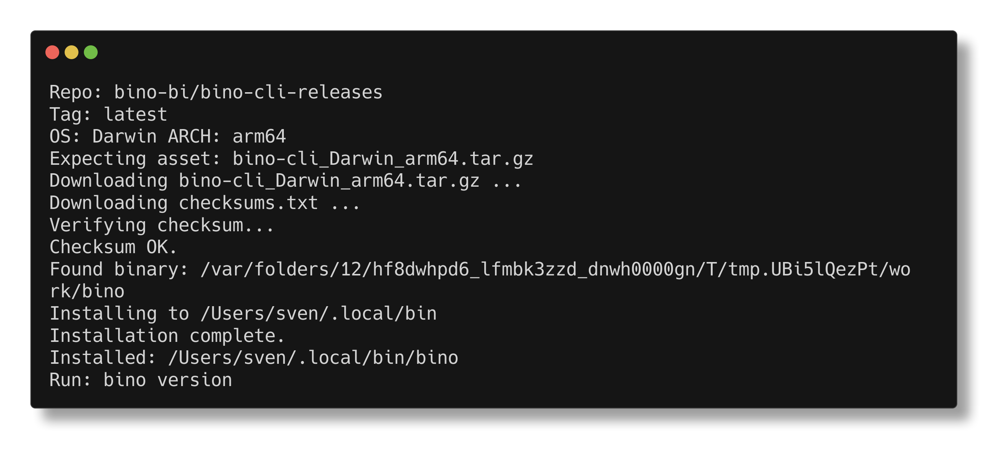

bino is a command-line tool for building pixel-perfect PDF reports from YAML and SQL.
This page shows how to install the binary on common platforms and confirm that everything works.

import { Aside } from "@astrojs/starlight/components";

## Supported platforms

bino provides pre-built binaries for:

- macOS (Intel, Apple Silicon)
- Linux x86_64
- Windows x86_64

## Install using the bundled installer script (recommended)

Installer scripts are published with each release. They automatically detect your OS/architecture, download the appropriate archive, verify the SHA-256 checksum (if present), and install the `bino` binary.

### Linux and macOS

Run directly (one-liner that executes the installer):

```sh
/bin/bash -c "$(curl -fsSL https://github.com/bino-bi/bino-cli-releases/releases/latest/download/install.sh)"
```



Safer (download then inspect):

```sh
curl -sL https://github.com/bino-bi/bino-cli-releases/releases/latest/download/install.sh -o install.sh
less install.sh
sh install.sh
```

Installer flags: `--repo`, `--tag`, `--install-dir`, `--dry-run`, `--yes`.

Prefer the two-step flow if you want to review the script before execution.

### Windows (PowerShell)

<Aside type="note">
  Requires Windows 10 or later with PowerShell 5.1+.
</Aside>

Run directly in PowerShell (one-liner):

```powershell
irm https://github.com/bino-bi/bino-cli-releases/releases/latest/download/install.ps1 | iex
```

Safer (download then inspect):

```powershell
Invoke-WebRequest -Uri https://github.com/bino-bi/bino-cli-releases/releases/latest/download/install.ps1 -OutFile install.ps1
Get-Content install.ps1 | Out-Host -Paging
.\install.ps1
```

Installer parameters: `-Repo`, `-Tag`, `-InstallDir`, `-DryRun`, `-Yes`.

The installer places `bino.exe` in `%LOCALAPPDATA%\bino` and adds it to your user PATH. You may need to restart your terminal for PATH changes to take effect.

## Install from GitHub Releases

1. Open the [bino-cli](https://github.com/bino-bi/bino-cli/) GitHub repository in your browser and go to the [**Releases**](https://github.com/bino-bi/bino-cli-releases/releases) page.
2. Download the archive that matches your platform, for example:
   - [bino-cli_Darwin_x86_64.tar.gz](https://github.com/bino-bi/bino-cli-releases/releases/latest/download/bino-cli_Darwin_x86_64.tar.gz)
   - [bino-cli_Darwin_arm64.tar.gz](https://github.com/bino-bi/bino-cli-releases/releases/latest/download/bino-cli_Darwin_arm64.tar.gz)
   - [bino-cli_Linux_x86_64.tar.gz](https://github.com/bino-bi/bino-cli-releases/releases/latest/download/bino-cli_Linux_x86_64.tar.gz)
   - [bino-cli_Windows_x86_64.zip](https://github.com/bino-bi/bino-cli-releases/releases/latest/download/bino-cli_Windows_x86_64.zip)
3. Unpack the archive:

   ```bash
   # macOS / Linux
   tar -xzvf bino-cli_Darwin_x86_64.tar.gz
   # or
   tar -xzvf bino-cli_Linux_x86_64.tar.gz
   ```

   On Windows, extract the `.zip` using File Explorer or a tool like 7-Zip.

4. Move the `bino` (or `bino.exe`) binary onto your `PATH`:

   ```bash
   # macOS / Linux (example)
   mv bino /usr/local/bin/
   ```

   On Windows, either place `bino.exe` in a folder that is already on `%PATH%` or add its folder to the system/user `PATH`.

5. Verify the installation:

   ```bash
   bino version
   ```

   This should print the installed version and exit with status code 0.

## Updating bino

To update bino to the latest version, run:

```sh
bino update
```

This command checks for the latest release on GitHub and performs an in-place update if a newer version is available. It works on all platforms (macOS, Linux, and Windows).

bino also performs a background check for updates once every 24 hours and will notify you if a new version is available.

## Next steps

- Continue with [Your first report](/getting-started/first-report/) to scaffold and build a sample report.
- See the [CLI overview](/cli/) for a quick tour of available commands.
